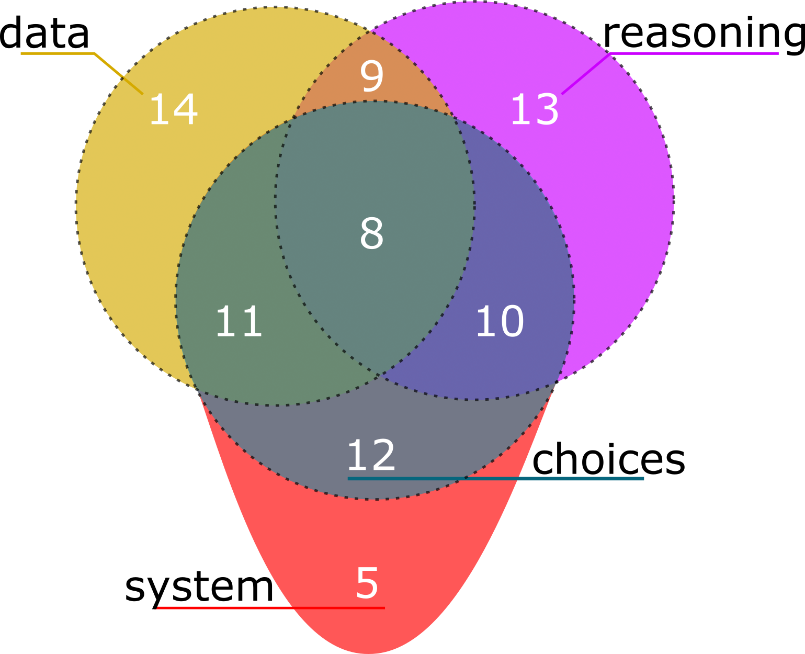
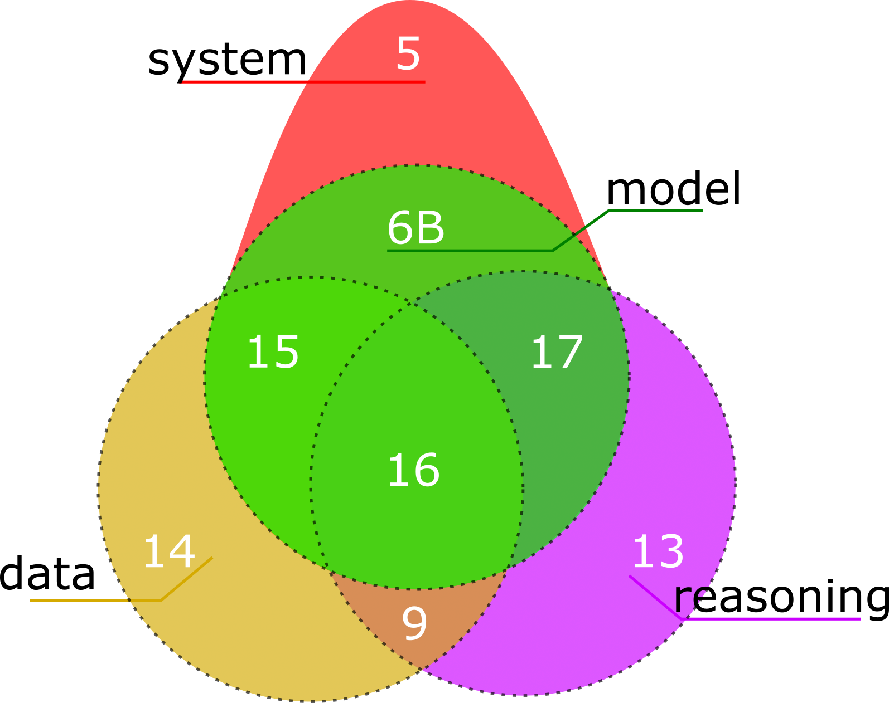
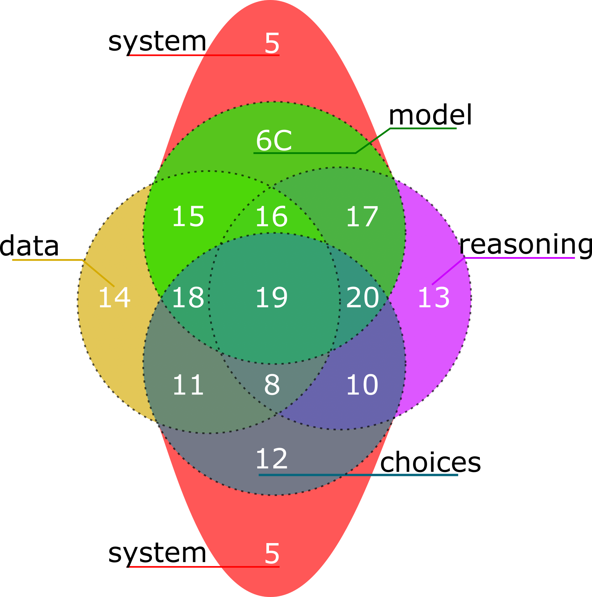

# Data-Aware Process Conformance:
## Propositions and Measures
An unpublished evaluation for data-aware process conformance concerned with the 
decision layer of a process model.
## Abstract
Process conformance measures (e.g. recall, precision, generalisation, simplicity) aim to quantify the quality of a process model (described) compared to an event log (observed), typically in terms of described and observed behaviour.
Guiding these measures is a collection of propositions or axioms, that establish the interpretation of measurements between a process model and an event log.
However, these propositions only consider desirable qualities for process conformance measures when comparing a language of process activities between a process model and an event log.
Furthermore, in our search of the literature, we saw little work that provided a precise interpretation for measuring the data perspective of a process or how this perspective should be considered for decision mining techniques.
Therefore, in this paper, we extend process conformance to consider the data perspective in a process by considering a specialisation we refer to as the decision view of a process.
To standardise and formalise the decision view of a process, we consider where choices occur in a process, the described guards that enable choices and how observed data is used to form guards.
We propose 13 quality propositions for data-aware process conformance measures that consider an event log and a process model.
Furthermore, these propositions provide a precise interpretation of the decision view of a process.
To validate our propositions, we present two data-aware process conformance measures for recall and precision; then, we evaluate our propositions by applying them to both new, and to existing data-aware conformance measures.

## Decision Layer vs Compliance Layer vs Data Perspective

### Decision layer

### Compliance Layer

### Data perspective

# Evaluation

To run the jupyter notebook for reproducing the testing conducted, ensure that
you use a python 3.9.7 installation and reproduce the a virtual environment using 
pipenv, i.e. pipenv install from the root of this repo. See pipenv for more 
information.

All event logs used in the evaluation (and the script to generate logs) can be 
found in the folder `logs`.
All process models used in the evaluation were generated using ProM and the "Edit 
DPN (Text Language based)" plug-in authored by F.Mannhardt and can be found in
the `models` folder. 